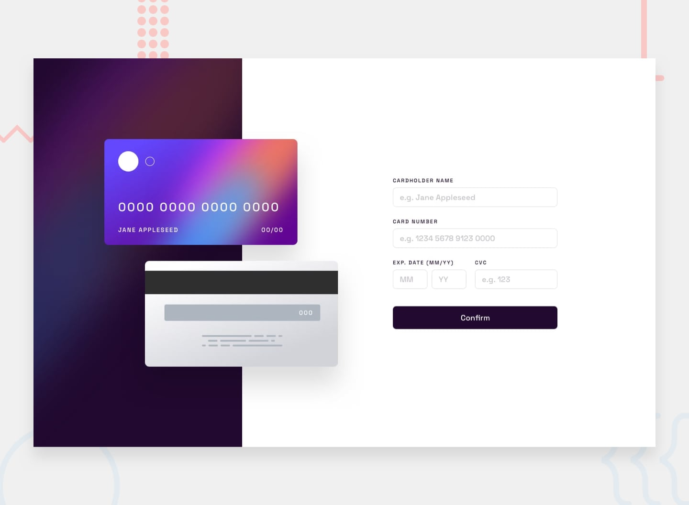

## Cartão interativo - Desafio do FrontEndMentor

Projeto feito para estudo de, posicionamentos e responsividade no css e para estudo de DOM com javascript e outras métodologias.

## Tecnologias 🚀
- HTML
- CSS
- JavaScript

## Design

# O desafio

Seu desafio é construir este formulário interativo de detalhes do cartão e fazer com que pareça o mais próximo possível do design.

Você pode usar qualquer ferramenta que desejar para ajudá-lo a completar o desafio. Então, se você tem algo que gostaria de praticar, sinta-se à vontade para tentar.

Seus usuários devem ser capazes de:

- Preencha o formulário e veja a atualização dos dados do cartão em tempo real
- Receba mensagens de erro quando o formulário for enviado se:
- Qualquer campo de entrada está vazio
- Os campos do número do cartão, data de validade ou CVC estão no formato errado
- Veja o layout ideal dependendo do tamanho da tela do dispositivo
- Veja os estados de foco, ativo e foco para elementos interativos na página
- Quer algum apoio no desafio? Junte-se à nossa comunidade Slack e tire dúvidas no canal #help.

### Comportamento esperado
Atualize os detalhes do cartão conforme o usuário preenche os campos
Valide os campos do formulário quando o formulário for enviado
Se não houver erros, exiba o estado concluído
Redefina o formulário quando o usuário clicar em "Continuar" no estado concluído

### Acesse o Projeto pelo link abaixo

